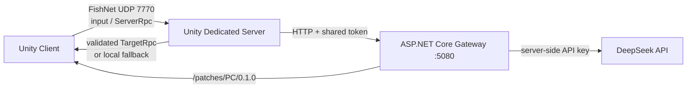

# Haven：联机生存游戏技术垂直切片

这是一个面向客户端/Unity 开发岗位的技术垂直切片，目标是完成双人局域网生存建造、受约束的 AI NPC 任务和代码/资源热更新。项目使用 Unity `6000.5.5f1`。当前仍处于开发阶段；下列技术原型不等于完整玩法已验收。

## 已有技术原型

新增单机营地委托与管事聊天入口：`Assets/Scenes/WorldGenMap.unity`。玩法、DeepSeek 配置、离线运行与独立构建说明见 [营地物资委托指南](docs/CAMP_QUESTS.md)，实际验证状态见 [验证记录](docs/CAMP_QUEST_VALIDATION.md)。聊天只生成对白，不直接修改背包或任务；这个单机场景不代表下述联机玩法已完成。

- FishNet + Tugboat：已有直连 Dedicated Server 的玩家移动原型，UDP `7770`，配置上限 4 人；房间和权威玩法尚待实现。
- 服务器权威移动：客户端只提交 WASD 输入，位置由服务器计算并同步。
- AIGC 安全链路：客户端不能接触 DeepSeek Key；请求经 ServerRpc 到 Dedicated Server，再访问 ASP.NET 网关。
- 结构化任务原型：只允许 `Collect`、`Wood/Stone`、`Food` 和数量 `1-10`；尚未连接真实世界状态与任务进度。
- 可用性保护：请求限流、超时、重试；DeepSeek 不可用时，游戏服返回确定性本地任务。
- 热更新：已有 YooAsset/HybridCLR 启动与本地补丁托管代码；双机首包与增量更新尚待验收。
- 自动化入口：场景生成、配置校验、热更发布、客户端和服务端构建均有 `Haven` 菜单。



关键代码入口：

- `Assets/framework/Runtime/Networking`：FishNet 服务、权威角色、DeepSeek 网关客户端、结果校验。
- `Assets/framework/Runtime/HotUpdate`：YooAsset 更新状态机和 HybridCLR 加载。
- `Assets/framework/Editor/Build`：一键生成演示场景及构建/发布入口。
- `Server/Haven.Gateway`：DeepSeek 代理与热更静态文件服务器。
- `Server/Haven.Gateway.Tests`：网关输入/输出策略测试。

## 第一次运行

### 1. 补齐 Unity 构建模块

在 Unity Hub 中为 `6000.5.5f1` 安装：

- `Windows Build Support (IL2CPP)`：客户端的 HybridCLR 构建需要。
- `Dedicated Server Build Support (Windows)`：服务端构建需要。

完整客户端和 Dedicated Server 构建必须在本机重新验收；此前的内容构建结果不能代替本分支的完整 Player 构建。

### 2. 准备 Unity 工程

打开项目后按顺序执行：

1. `Haven/Framework/2. Install HybridCLR Runtime`（首次克隆或升级 Unity/HybridCLR 时）。
2. `Haven/Network/1. Create or Refresh Demo`（演示场景已经生成，修改网络配置后再执行）。
3. `Haven/Framework/Validate Project` 和 `Haven/Network/Validate Demo`。

直接在 Editor 打开 `Assets/Scenes/FrameworkDemo.unity` 可使用 EditorDirect 模式开发业务，不需要启动补丁服务器。

### 3. 启动网关

仅在自己的私人路由器或手机热点上配置局域网。先以管理员身份检测当前网络并按 [局域网热更新指南](docs/LAN_HOT_UPDATE.md) 配置防火墙；不要在校园公共 Wi-Fi 上设置 Private。普通 PowerShell 启动网关：

```powershell
.\scripts\start-gateway.ps1
```

纯热更新联调不需要 DeepSeek Key；需要真实 AIGC 时才在服务器进程环境变量中设置 `DeepSeek__ApiKey` 和 `Gateway__SharedToken`，不要写入 Unity、`appsettings.json` 或 Git。检查：

```powershell
.\scripts\test-lan-hotupdate.ps1 -ServerAddress 127.0.0.1
```

没有 Key 时网关仍可用于热更托管；AIGC 请求会得到 `503`，随后 Dedicated Server 自动使用本地任务降级。

### 4. 构建内容与程序

Unity 菜单：

- `Haven/Content/1. Build Current Assets and Publish Locally`：构建当前热更内容并发布到 `Build/LocalServer/patches`。
- `Haven/Content/2. Compile Hotfix and Publish Locally`：只更新业务 DLL/内容，不重建客户端。
- `Haven/Build/Windows Dedicated Server`：构建 `Build/WindowsServer/HavenServer.exe`。
- `Haven/Build/Windows Client (HybridCLR)`：Generate All、制作首包内容并构建 `Build/WindowsClient/HavenClient.exe`。

客户端构建时工具会临时把热更模式切为 `Host`，并使用可选的 `HAVEN_PATCH_BASE_URL` 环境变量作为本次构建的补丁地址，构建结束恢复 EditorDirect 与项目内的回环配置；服务端构建时会临时关闭 HybridCLR，避免服务端被强制切成 IL2CPP。详情见 [局域网热更新指南](docs/LAN_HOT_UPDATE.md)。

### 5. 本地联调

网关和 Dedicated Server 必须使用相同的共享令牌。在第二个 PowerShell 中启动服务端：

```powershell
$env:HAVEN_GATEWAY_TOKEN = '与 Gateway__SharedToken 相同的值'
./Build/WindowsServer/HavenServer.exe -batchmode -nographics -logFile ./Build/WindowsServer/server.log
```

再运行 `HavenClient.exe`，点击“连接 Dedicated Server”，用 WASD 移动，然后点击“由服务器请求 DeepSeek 生成任务”。当前属于技术原型，并非可完成的任务系统。局域网游戏联调需要额外在 Private 网络放行 UDP `7770`，补丁使用 TCP `5080`。

## 验证命令

```powershell
dotnet test ./Server/Haven.Gateway.Tests/Haven.Gateway.Tests.csproj --configuration Release
```

Unity 测试应在 Test Runner 中运行 `EditMode`，并以当前分支实际日志为准；不要沿用旧分支的测试数字。

## 发布边界

- `DeepSeek__ApiKey` 只存在于网关进程环境变量。
- `Gateway__SharedToken` / `HAVEN_GATEWAY_TOKEN` 是内网共享密钥，不是玩家身份认证方案；公网部署应再加 HTTPS、反向代理和正式鉴权。
- `Build/`、`Library/`、`HybridCLRData/`、日志和服务端 `bin/obj` 已忽略，不应同步到 GitHub。
- 热更脚本只能引用稳定的 AOT 契约；修改 AOT 类型或升级 Unity 后，要重新 Generate All 并发布新的完整客户端。
